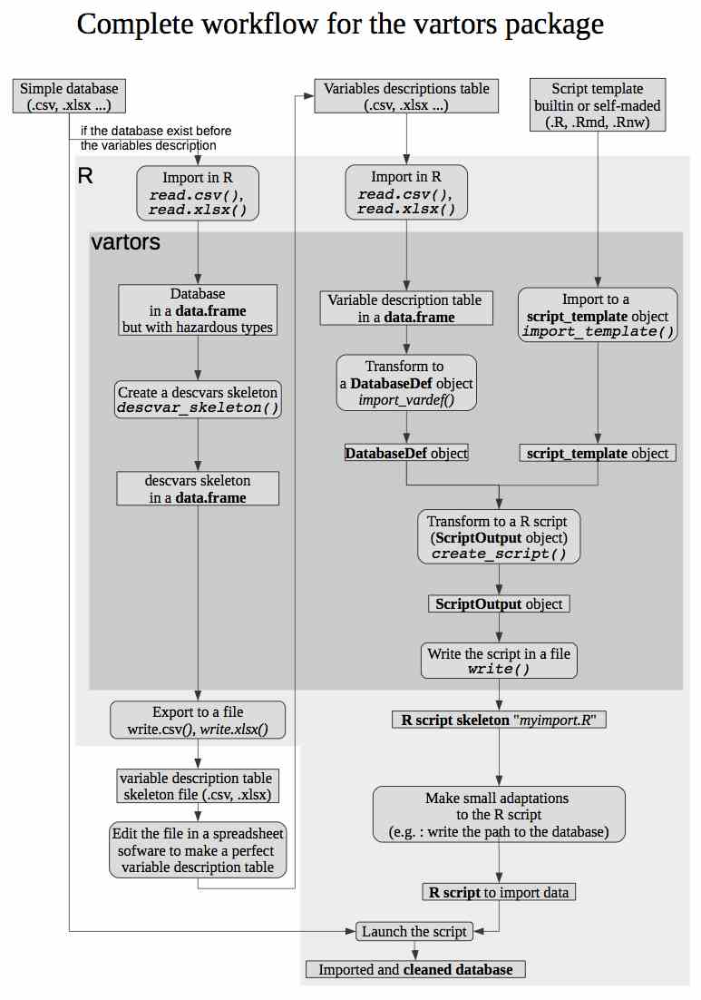

<!--
%\VignetteEngine{knitr::knitr}
%\VignetteIndexEntry{Workflow of vartors package}
-->

```{r, echo = FALSE, message = FALSE}
library(knitr)
knitr::opts_chunk$set(
  comment = "#>",
  error = FALSE,
  tidy = FALSE
)

library(vartors)
```

# Main workflow

